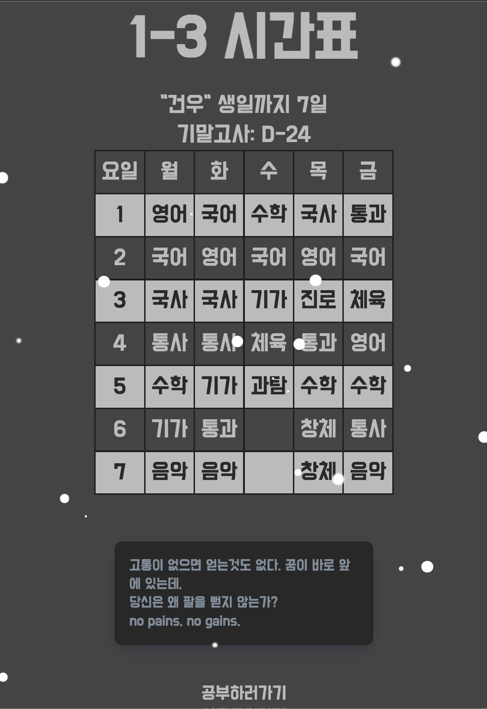

# 103-zoom
1학년 3반만의 줌 접속 시간표입니다.



이용해보기[https://103-zoom.netlify.app/]

## ver 0.1
- [x] 시간표 구현
- [x] 과목 클릭시 줌 주소 연결

## ver 0.2 
- [x] D-DAY 기능 구현
- [x] css 보완

## ver 0.3
- [x] 다크 모드 적용
- [x] 공부하러가기 기능 구현(pomusic)

## ver 0.4
- [x] 특정 시간 되면 alert 생성! (실행 안됨..)

## ver 0.4.1
- [x] 웹 사이트 공유시 title, description, image, url을 뜨게 함.

```html
    <meta property="og:type" content="website">
    <meta property="og:title" content="1학년 3반만의 줌 시간표">
    <meta property="og:description" content="10302 구현승 제작">
    <meta property="og:image" content="https://103-zoom.netlify.app/103zoom.png">
    <meta property="og:url" content="https://103-zoom.netlify.app/">
```

## ver 0.4.2
- [x] 친구들 요청으로 기말고사 디데이 설정 변경
- [x] 건우 생일 디데이 추가

## ver 0.5
- [x] 선물해주기 기능(11월 25일 오픈 예정)
- [x] 눈 내리는 효과 구현

## ver 0.6
- [x] 동기부여 랜덤 발생 구현 ([yoonhero](https://github.com/yoonhero)님의 time-timer quote를 참고함.)

# 프로젝트 종료!


노마드코더 #sideprojects [보러가기](https://nomadcoders.co/community/thread/5949)


 
